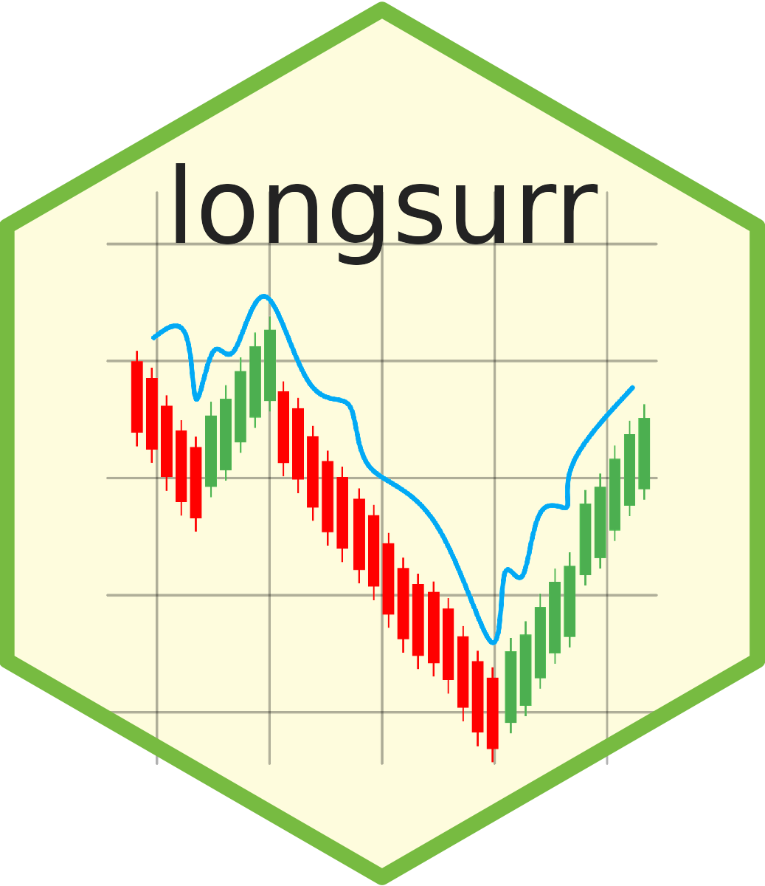

# longsurr 

<!-- badges: start -->

<!-- badges: end -->

`longsurr` is an `R` package to (1) assess the proportion of treatment effect explained by a longitudinal surrogate marker, and (2) estimate the treatment effect on a longitudinal surrogate marker   

All methods are described in detail in Agniel and Parast (2021). Evaluation of Longitudinal Surrogate Markers, Biometrics, 77(2): 477-489, [doi:10.1111/biom.13310](https://doi.org/10.1111/biom.13310) and Wang et al (2025) "Semiparametric Joint Modeling to Estimate the Treatment Effect on a Longitudinal Surrogate with Application to Chronic Kidney Disease Trials," Biometrics, 81(3): ujaf104, [doi: 10.1093/biomtc/ujaf104](https://doi.org/10.1093/biomtc/ujaf104).

Go here to view a tutorial for this package: [longsurr Tutorial](https://htmlpreview.github.io/?https://github.com/laylaparast/longsurr/blob/main/longsurr_tutorial.html). 
